<div align="center">


### Unit tests for your LLM prompts.

Define behavioral test suites with rich assertions, run them against a deterministic offline mock model (no API keys) or real providers, and get an interactive HTML report plus run-over-run regression detection.

[](https://github.com/rxNxkolai/litmus/actions/workflows/ci.yml)
[](LICENSE)
[](package.json)
[](package.json)



</div>

## The problem

You change one line of a system prompt and ship it. Three things you did not expect now break: the model stops returning valid JSON, a classification flips, responses balloon past your token budget. Nothing told you, because prompts have no tests. litmus is that missing layer, and it runs offline and free by default.

## The report

Every run produces an interactive, self-contained HTML report: pass/fail per case, the assertions, and the exact prompt and response.

<div align="center">

</div>

## Quick start

A suite is a `*.suite.json` or `*.suite.mjs` file describing one prompt template and a list of cases:

```js
// sentiment.suite.mjs
export default {
  name: 'sentiment-classifier',
  model: 'mock:sentiment', // deterministic offline model, no API key
  prompt: 'Classify the sentiment of this review as JSON: {{review}}',
  cases: [
    {
      name: 'clear positive',
      vars: { review: 'I love this, it is great!' },
      assert: [{ type: 'is-json' }, { type: 'json-path', path: 'sentiment', equals: 'positive' }],
    },
  ],
};
```

```bash
litmus run sentiment.suite.mjs --html report.html
```

## Assertions

| Assertion                   | Passes when                                               |
| --------------------------- | --------------------------------------------------------- |
| `contains` / `not-contains` | The output does (or does not) contain a substring         |
| `equals`                    | The output equals a value (`trim`, `ignoreCase` optional) |
| `regex`                     | The output matches a pattern                              |
| `is-json`                   | The output parses as JSON                                 |
| `json-path`                 | A path (`a.b[0]`) `exists`, or `equals` a value           |
| `one-of`                    | The output is one of a set of allowed values              |
| `min-length` / `max-length` | The output length is within bounds                        |
| `max-latency-ms`            | The call finished within a time budget                    |
| `max-cost-usd`              | The estimated cost stayed under a budget                  |

## Providers

| Provider         | Notes                                                                                               |
| ---------------- | --------------------------------------------------------------------------------------------------- |
| `mock` (default) | Deterministic, offline, no key. `mock:sentiment`, `mock:json`, `mock:echo`. Ideal for tests and CI. |
| `openai`         | `gpt-4o-mini`, `gpt-4o`. Requires `OPENAI_API_KEY`                                                  |
| `anthropic`      | `claude-3-5-haiku`, `claude-3-5-sonnet`. Requires `ANTHROPIC_API_KEY`                               |

## Regression detection

Every run is saved to `.litmus/runs/`. The next run is compared against the previous one, and any case that flipped from pass to fail is surfaced in the terminal and as a banner in the HTML report.

## CLI

```bash
litmus run <files-or-dirs...>   # run suites, report, save the run
litmus report                   # re-render the latest run as HTML
litmus list                     # list saved runs
litmus init                     # write a starter suite
```

Exit codes: `0` all passed, `1` failures, `2` bad usage. A drop-in CI gate for your prompts.

## Install

Not yet on npm. Run it from GitHub:

```bash
npx github:rxNxkolai/litmus init
npx github:rxNxkolai/litmus run example.suite.mjs
```

Or clone and build:

```bash
git clone https://github.com/rxNxkolai/litmus.git
cd litmus
npm install        # builds automatically via the prepare script
node dist/cli.js run examples/ --html report.html
```

## Programmatic API

```ts
import { runSuite, getProvider } from 'litmus';

const result = await runSuite(mySuite, { provider: getProvider('mock'), model: 'mock:sentiment' });
console.log(result.passed, '/', result.total);
```

## Development

```bash
npm install        # install + build
npm test           # vitest
npm run typecheck  # tsc --noEmit
npm run build      # tsup -> dist/
```

## License

[MIT](LICENSE) © Nikolai
