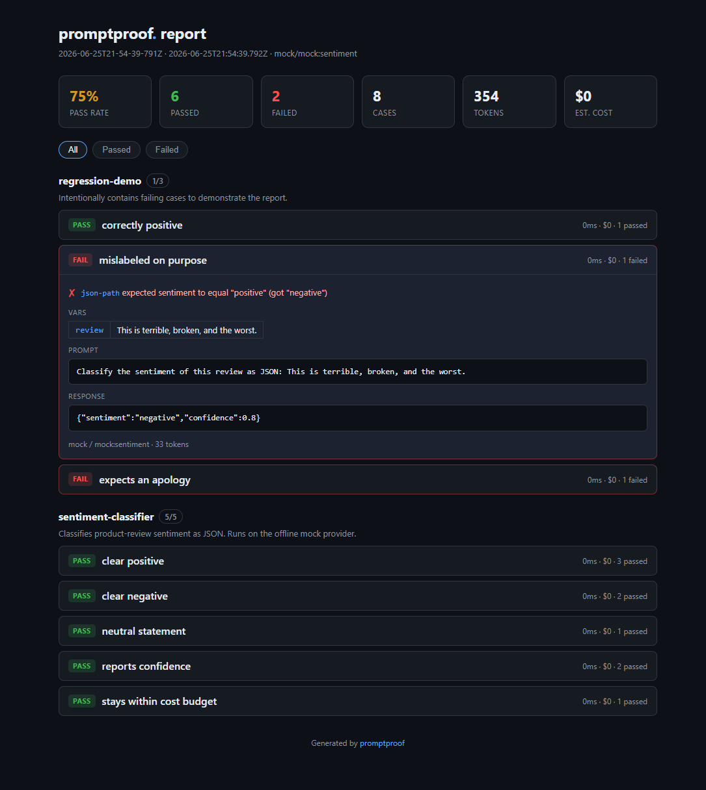

# promptproof

[](https://github.com/rxNxkolai/promptproof/actions/workflows/ci.yml)
[](LICENSE)
[](package.json)
[](package.json)

**Unit tests for your LLM prompts.** Define behavioral test suites with rich assertions, run them against a deterministic offline mock model (no API keys) or real providers, and get a polished interactive HTML report plus run-over-run regression detection.

Prompts are code. They regress silently when you tweak wording, swap a model, or refactor a template. promptproof gives that code a test suite.



## Why

You change one line of a system prompt and ship it. Three things you did not expect now break: the model stops returning valid JSON, a classification flips, responses balloon past your token budget. Nothing told you, because prompts have no tests. promptproof is that missing layer:

- **Behavioral, not stylistic.** It runs the prompt and checks the output, unlike a static linter.
- **Offline by default.** A deterministic `mock` provider means the example suite and your CI run with zero keys and zero cost.
- **Regression-aware.** Every run is saved, so the next run tells you exactly which cases flipped from pass to fail.
- **Zero runtime dependencies.** Pure TypeScript over `fetch` and `node:fs`.

## Install

Not yet on npm. Run it straight from GitHub:

```bash
npx github:rxNxkolai/promptproof init        # write a starter suite
npx github:rxNxkolai/promptproof run example.suite.mjs
```

Or clone and build:

```bash
git clone https://github.com/rxNxkolai/promptproof.git
cd promptproof
npm install          # builds automatically via the prepare script
node dist/cli.js run examples/ --html report.html
```

## Quick start

A suite is a `*.suite.json` or `*.suite.mjs` file describing one prompt template and a list of cases:

```js
// sentiment.suite.mjs
export default {
  name: 'sentiment-classifier',
  model: 'mock:sentiment', // deterministic offline model, no API key
  prompt: 'Classify the sentiment of this review as JSON: {{review}}',
  cases: [
    {
      name: 'clear positive',
      vars: { review: 'I love this, it is great!' },
      assert: [{ type: 'is-json' }, { type: 'json-path', path: 'sentiment', equals: 'positive' }],
    },
    {
      name: 'clear negative',
      vars: { review: 'Terrible and buggy, the worst.' },
      assert: [{ type: 'json-path', path: 'sentiment', equals: 'negative' }],
    },
  ],
};
```

```bash
promptproof run sentiment.suite.mjs --html report.html
```

```text
sentiment-classifier (2/2 passed)
  PASS  clear positive  1ms
  PASS  clear negative  0ms

2/2 passed
HTML report written to report.html
```

## Assertions

| Assertion                   | Passes when                                                               |
| --------------------------- | ------------------------------------------------------------------------- |
| `contains` / `not-contains` | The output does (or does not) contain a substring (`ignoreCase` optional) |
| `equals`                    | The output equals a value (`trim`, `ignoreCase` optional)                 |
| `regex`                     | The output matches a pattern (`flags` optional)                           |
| `is-json`                   | The output parses as JSON                                                 |
| `json-path`                 | A path (`a.b[0]`) `exists`, or `equals` a value                           |
| `one-of`                    | The output is one of a set of allowed values                              |
| `min-length` / `max-length` | The output length is within bounds                                        |
| `max-latency-ms`            | The call finished within a time budget                                    |
| `max-cost-usd`              | The estimated cost stayed under a budget                                  |

## Providers

| Provider         | Model examples                             | Notes                                                   |
| ---------------- | ------------------------------------------ | ------------------------------------------------------- |
| `mock` (default) | `mock:sentiment`, `mock:json`, `mock:echo` | Deterministic, offline, no key. Ideal for tests and CI. |
| `openai`         | `gpt-4o-mini`, `gpt-4o`                    | Requires `OPENAI_API_KEY`                               |
| `anthropic`      | `claude-3-5-haiku`, `claude-3-5-sonnet`    | Requires `ANTHROPIC_API_KEY`                            |

Pick a provider per run (`--provider openai --model gpt-4o-mini`) or per suite (the `provider` / `model` fields). A CLI flag overrides the suite. Without a key, real providers fail each case with a clear message instead of crashing, so suites stay runnable offline.

## CLI

```bash
promptproof run <files-or-dirs...>   # run suites, report, save the run
promptproof report                   # re-render the latest run as HTML
promptproof list                     # list saved runs
promptproof init                     # write a starter suite
```

| Flag                    | Description                                        |
| ----------------------- | -------------------------------------------------- |
| `-p, --provider <name>` | `mock` \| `openai` \| `anthropic` (default `mock`) |
| `-m, --model <id>`      | Model id (default: per-suite or provider default)  |
| `--html <path>`         | Write an interactive HTML report                   |
| `--json`                | Emit machine-readable JSON                         |
| `--no-save`             | Do not persist this run                            |
| `--no-color`            | Disable colored output                             |

Exit codes: `0` all passed, `1` failures, `2` bad usage. That makes `promptproof run` a drop-in CI gate.

## Regression detection

Every run is saved to `.promptproof/runs/`. The next run is compared against the previous one, and any case that flipped from pass to fail is surfaced both in the terminal and as a banner in the HTML report:

```text
⚠ 1 regression(s) since last run:
    sentiment-classifier :: clear negative
```

## Programmatic API

```ts
import { runSuite, getProvider, renderHtml } from 'promptproof';

const result = await runSuite(mySuite, {
  provider: getProvider('mock'),
  model: 'mock:sentiment',
});

console.log(result.passed, '/', result.total);
```

## Use in CI

```yaml
name: promptproof
on: [pull_request]
jobs:
  prompts:
    runs-on: ubuntu-latest
    steps:
      - uses: actions/checkout@v4
      - uses: actions/setup-node@v4
        with:
          node-version: 20
      - run: npx github:rxNxkolai/promptproof run prompts/ --no-color
```

## Development

```bash
npm install        # install + build
npm test           # vitest
npm run typecheck  # tsc --noEmit
npm run build      # tsup -> dist/
```

## License

[MIT](LICENSE) © Nikolai
